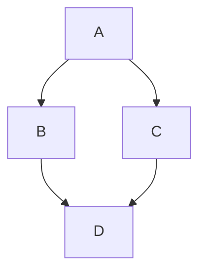

# Writing Markdonw

## [Github styles](https://docs.github.com/en/get-started/writing-on-github/getting-started-with-writing-and-formatting-on-github/basic-writing-and-formatting-syntax)

<!-- region Headings -->
## Headings

```markdown
# Heading 1
## Heading 2
### Heading 3
```

# Heading 1
## Heading 2
### Heading 3

<!-- endregion Headings -->

<!-- region Images -->
## Images

```markdown

```

<!-- endregion Images -->

<!-- region Links -->

## Links

```markdown
[Google](https://www.google.com)
```
[Google](https://www.google.com)

## Section links

If you need to determine the anchor for a heading in a file you are editing, you can use the following basic rules:

* Letters are converted to lower-case.
* Spaces are replaced by hyphens (`-`). Any other whitespace or punctuation characters are removed.
* Leading and trailing whitespace are removed.
* Markup formatting is removed, leaving only the contents (for example, `_italics_` becomes `italics`).
* If the automatically generated anchor for a heading is identical to an earlier anchor in the same document, a unique identifier is generated by appending a hyphen and an auto-incrementing integer.

For more detailed information on the requirements of URI fragments, see [RFC 3986: Uniform Resource Identifier (URI): Generic Syntax, Section 3.5](https://www.rfc-editor.org/rfc/rfc3986#section-3.5).

The code block below demonstrates the basic rules used to generate anchors from headings in rendered content.

```markdown
# Example headings

## Sample Section

## This'll be a _Helpful_ Section About the Greek Letter Θ!
A heading containing characters not allowed in fragments, UTF-8 characters, two consecutive spaces between the first and second words, and formatting.

## This heading is not unique in the file

TEXT 1

## This heading is not unique in the file

TEXT 2

# Links to the example headings above

Link to the sample section: [Link Text](#sample-section).

Link to the helpful section: [Link Text](#thisll-be-a-helpful-section-about-the-greek-letter-Θ).

Link to the first non-unique section: [Link Text](#this-heading-is-not-unique-in-the-file).

Link to the second non-unique section: [Link Text](#this-heading-is-not-unique-in-the-file-1).
```
# Example headings

## Sample Section

## This'll be a _Helpful_ Section About the Greek Letter Θ!
A heading containing characters not allowed in fragments, UTF-8 characters, two consecutive spaces between the first and second words, and formatting.

## This heading is not unique in the file

TEXT 1

## This heading is not unique in the file

TEXT 2

# Links to the example headings above

Link to the sample section: [Link Text](#sample-section).

Link to the helpful section: [Link Text](#thisll-be-a-helpful-section-about-the-greek-letter-Θ).

Link to the first non-unique section: [Link Text](#this-heading-is-not-unique-in-the-file).

Link to the second non-unique section: [Link Text](#this-heading-is-not-unique-in-the-file-1).


<!-- endregion Links -->

<!-- region Lists -->

## Lists

### Numered 

```markdown
1. First item
2. Second item
3. Third item
```
1. First item
2. Second item
3. Third item

### Unordered

```markdown
- First item
- Second item
- Third item
```
- First item
- Second item
- Third item

You can make an unordered list by preceding one or more lines of text with <kbd>-</kbd>, <kbd>*</kbd>, or <kbd>+</kbd>.

```markdown
- George Washington
* John Adams
+ Thomas Jefferson
```
- George Washington
* John Adams
+ Thomas Jefferson

### Nested Lists

You can create a nested list by indenting one or more list items below another item.

To create a nested list using the web editor on  or a text editor that uses a monospaced font, like [vscode](https://code.visualstudio.com/), you can align your list visually. Type space characters in front of your nested list item until the list marker character (<kbd>-</kbd> or <kbd>*</kbd>) lies directly below the first character of the text in the item above it.

```markdown
1. First list item
   - First nested list item
     - Second nested list item
```


<!-- endregion Lists -->

<!-- region Task lists -->

## Task lists



If a task list item description begins with a parenthesis, you'll need to escape it with <kbd>\\</kbd>:

`- [ ] \(Optional) Open a followup issue`

For more information, see [AUTOTITLE](/get-started/writing-on-github/working-with-advanced-formatting/about-task-lists).

<!-- endregion Task lists -->

<!-- region Styling -->
## Styling text

You can indicate emphasis with bold, italic, strikethrough, subscript, or superscript text in comment fields and `.md` files.

| Style | Syntax | Keyboard shortcut | Example | Output |
| --- | --- | --- | --- | --- |
| Bold | `** **` or `__ __`| <kbd>Command</kbd>+<kbd>B</kbd> (Mac) or <kbd>Ctrl</kbd>+<kbd>B</kbd> (Windows/Linux) | `**This is bold text**` | **This is bold text** |
| Italic | `* *` or `_ _`     | <kbd>Command</kbd>+<kbd>I</kbd> (Mac) or <kbd>Ctrl</kbd>+<kbd>I</kbd> (Windows/Linux) | `_This text is italicized_` | _This text is italicized_ |
| Strikethrough | `~~ ~~` | None | `~~This was mistaken text~~` | ~~This was mistaken text~~ |
| Bold and nested italic | `** **` and `_ _` | None | `**This text is _extremely_ important**` | **This text is _extremely_ important** |
| All bold and italic | `*** ***` | None | `***All this text is important***` | ***All this text is important*** | <!-- markdownlint-disable-line emphasis-style -->
| Subscript | `<sub> </sub>` | None | `This is a <sub>subscript</sub> text` | This is a <sub>subscript</sub> text |
| Superscript | `<sup> </sup>` | None | `This is a <sup>superscript</sup> text` | This is a <sup>superscript</sup> text |
| Underline | `<ins> </ins>` | None | `This is an <ins>underlined</ins> text` | This is an <ins>underlined</ins> text |
<!-- endregion Styling -->

<!-- region Quoting -->

## Quoting text

You can quote text with a <kbd>></kbd>.

```markdown
Text that is not a quote

> Text that is a quote
```
Text that is not a quote

> Text that is a quote


```markdown
> [!NOTE]
> When viewing a conversation, you can automatically quote text in a comment by highlighting the text, then typing <kbd>R</kbd>. You can quote an entire comment by clicking , then **Quote reply**. For more information about keyboard shortcuts, see [AUTOTITLE](/get-started/accessibility/keyboard-shortcuts).
```
> [!NOTE]
> When viewing a conversation, you can automatically quote text in a comment by highlighting the text, then typing <kbd>R</kbd>. You can quote an entire comment by clicking , then **Quote reply**. For more information about keyboard shortcuts, see [AUTOTITLE](/get-started/accessibility/keyboard-shortcuts).


<!-- endregion Quoting -->

<!-- region Accordion -->

## Accordion

```markdown
<details>
<summary>Click to expand!</summary>

Content that will be hidden until expanded.
  
</details>
```
<details>
<summary>Click to expand!</summary>

Content that will be hidden until expanded.
  
</details>

<!-- endregion Accordion -->

<!-- region Footnotes  -->

## Footnotes

You can add footnotes to your content by using this bracket syntax:

```text
Here is a simple footnote[^1].

A footnote can also have multiple lines[^2].

[^1]: My reference.
[^2]: To add line breaks within a footnote, prefix new lines with 2 spaces.
  This is a second line.
```

The footnote will render like this:

Here is a simple footnote[^1].

A footnote can also have multiple lines[^2].

[^1]: My reference.
[^2]: To add line breaks within a footnote, prefix new lines with 2 spaces.
  This is a second line.


> [!NOTE]
> The position of a footnote in your Markdown does not influence where the footnote will be rendered. You can write a footnote right after your reference to the footnote, and the footnote will still render at the bottom of the Markdown. Footnotes are not supported in wikis.

<!-- endregion Footnotes  -->

<!-- region Alerts  -->

## Alerts

Alerts are a Markdown extension based on the blockquote syntax that you can use to emphasize critical information. On , they are displayed with distinctive colors and icons to indicate the significance of the content.

Use alerts only when they are crucial for user success and limit them to one or two per article to prevent overloading the reader. Additionally, you should avoid placing alerts consecutively. Alerts cannot be nested within other elements.

To add an alert, use a special blockquote line specifying the alert type, followed by the alert information in a standard blockquote. Five types of alerts are available:

```markdown
> [!NOTE]
> Useful information that users should know, even when skimming content.

> [!TIP]
> Helpful advice for doing things better or more easily.

> [!IMPORTANT]
> Key information users need to know to achieve their goal.

> [!WARNING]
> Urgent info that needs immediate user attention to avoid problems.

> [!CAUTION]
> Advises about risks or negative outcomes of certain actions.
```

Here are the rendered alerts:
> [!NOTE]
> Useful information that users should know, even when skimming content.

> [!TIP]
> Helpful advice for doing things better or more easily.

> [!IMPORTANT]
> Key information users need to know to achieve their goal.

> [!WARNING]
> Urgent info that needs immediate user attention to avoid problems.

> [!CAUTION]
> Advises about risks or negative outcomes of certain actions.


## Hiding content with comments

You can tell to hide content from the rendered Markdown by placing the content in an HTML comment.

```text
<!-- This content will not appear in the rendered Markdown -->
```

## Ignoring Markdown formatting

You can tell  to ignore (or escape) Markdown formatting by using <kbd>\\</kbd> before the Markdown character.

`Let's rename \*our-new-project\* to \*our-old-project\*.`


For more information on backslashes, see Daring Fireball's [Markdown Syntax](https://daringfireball.net/projects/markdown/syntax#backslash).

> [!NOTE]
> The Markdown formatting will not be ignored in the title of an issue or a pull request.

<!-- region Alerts  -->

<!-- region OpenAPI -->

## API Reference

#### Get all items

```http
  GET /api/items
```

| Parameter | Type     | Description                |
| :-------- | :------- | :------------------------- |
| `api_key` | `string` | **Required**. Your API key |

#### Get item

```http
  GET /api/items/${id}
```

| Parameter | Type     | Description                       |
| :-------- | :------- | :-------------------------------- |
| `id`      | `string` | **Required**. Id of item to fetch |

#### add(num1, num2)

Takes two numbers and returns the sum.

<!-- endregion OpenAPI -->

<!-- region Badges -->

## Badges

Add badges from somewhere like: [shields.io](https://shields.io/)

[](https://choosealicense.com/licenses/mit/)
[](https://opensource.org/licenses/)
[](http://www.gnu.org/licenses/agpl-3.0)
🔗 Links
[](https://raphaelcarlosr.dev/)
[](https://www.linkedin.com/in/raphaelcarlosr)
[](https://twitter.com/raphaelcarlosr)


<!-- endregion Badges -->

<!-- region Colors -->


## Color Reference

| Color             | Hex                                                                |
| ----------------- | ------------------------------------------------------------------ |
| Example Color |  #0a192f |
| Example Color |  #f8f8f8 |
| Example Color |  #00b48a |
| Example Color |  #00d1a0 |


### Supported color models

In issues, pull requests, and discussions, you can call out colors within a sentence by using backticks. A supported color model within backticks will display a visualization of the color.

```markdown
The background color is `#ffffff` for light mode and `#000000` for dark mode.
```


Here are the currently supported color models.

| Color | Syntax | Example | Output |
| --- | --- | --- | --- |
| HEX | <code>\`#RRGGBB\`</code> | <code>\`#0969DA\`</code> |  |
| RGB | <code>\`rgb(R,G,B)\`</code> | <code>\`rgb(9, 105, 218)\`</code> |  |
| HSL | <code>\`hsl(H,S,L)\`</code> | <code>\`hsl(212, 92%, 45%)\`</code> |  |

> [!NOTE]
> * A supported color model cannot have any leading or trailing spaces within the backticks.
> * The visualization of the color is only supported in issues, pull requests, and discussions.


<!-- endregion Colors -->

<!-- region Shapes -->

## ASCII STL

```plaintext
solid cube_corner
  facet normal 0.0 -1.0 0.0
    outer loop
      vertex 0.0 0.0 0.0
      vertex 1.0 0.0 0.0
      vertex 0.0 0.0 1.0
    endloop
  endfacet
  facet normal 0.0 0.0 -1.0
    outer loop
      vertex 0.0 0.0 0.0
      vertex 0.0 1.0 0.0
      vertex 1.0 0.0 0.0
    endloop
  endfacet
  facet normal -1.0 0.0 0.0
    outer loop
      vertex 0.0 0.0 0.0
      vertex 0.0 0.0 1.0
      vertex 0.0 1.0 0.0
    endloop
  endfacet
  facet normal 0.577 0.577 0.577
    outer loop
      vertex 1.0 0.0 0.0
      vertex 0.0 1.0 0.0
      vertex 0.0 0.0 1.0
    endloop
  endfacet
endsolid
```

```stl
solid cube_corner
  facet normal 0.0 -1.0 0.0
    outer loop
      vertex 0.0 0.0 0.0
      vertex 1.0 0.0 0.0
      vertex 0.0 0.0 1.0
    endloop
  endfacet
  facet normal 0.0 0.0 -1.0
    outer loop
      vertex 0.0 0.0 0.0
      vertex 0.0 1.0 0.0
      vertex 1.0 0.0 0.0
    endloop
  endfacet
  facet normal -1.0 0.0 0.0
    outer loop
      vertex 0.0 0.0 0.0
      vertex 0.0 0.0 1.0
      vertex 0.0 1.0 0.0
    endloop
  endfacet
  facet normal 0.577 0.577 0.577
    outer loop
      vertex 1.0 0.0 0.0
      vertex 0.0 1.0 0.0
      vertex 0.0 0.0 1.0
    endloop
  endfacet
endsolid
```

<!-- endregion Shapes -->

<!-- region Geon -->

## TopoJSON
For example, you can create a TopoJSON map by specifying coordinates and shapes.

```json
{
  "type": "Topology",
  "transform": {
    "scale": [0.0005000500050005, 0.00010001000100010001],
    "translate": [100, 0]
  },
  "objects": {
    "example": {
      "type": "GeometryCollection",
      "geometries": [
        {
          "type": "Point",
          "properties": {"prop0": "value0"},
          "coordinates": [4000, 5000]
        },
        {
          "type": "LineString",
          "properties": {"prop0": "value0", "prop1": 0},
          "arcs": [0]
        },
        {
          "type": "Polygon",
          "properties": {"prop0": "value0",
            "prop1": {"this": "that"}
          },
          "arcs": [[1]]
        }
      ]
    }
  },
  "arcs": [[[4000, 0], [1999, 9999], [2000, -9999], [2000, 9999]],[[0, 0], [0, 9999], [2000, 0], [0, -9999], [-2000, 0]]]
}
```

```topojson
{
  "type": "Topology",
  "transform": {
    "scale": [0.0005000500050005, 0.00010001000100010001],
    "translate": [100, 0]
  },
  "objects": {
    "example": {
      "type": "GeometryCollection",
      "geometries": [
        {
          "type": "Point",
          "properties": {"prop0": "value0"},
          "coordinates": [4000, 5000]
        },
        {
          "type": "LineString",
          "properties": {"prop0": "value0", "prop1": 0},
          "arcs": [0]
        },
        {
          "type": "Polygon",
          "properties": {"prop0": "value0",
            "prop1": {"this": "that"}
          },
          "arcs": [[1]]
        }
      ]
    }
  },
  "arcs": [[[4000, 0], [1999, 9999], [2000, -9999], [2000, 9999]],[[0, 0], [0, 9999], [2000, 0], [0, -9999], [-2000, 0]]]
}
```


## GeoJSON
This section can include GeoJSON examples or descriptions.

```json
{
  "type": "FeatureCollection",
  "features": [
    {
      "type": "Feature",
      "id": 1,
      "properties": {
        "ID": 0
      },
      "geometry": {
        "type": "Polygon",
        "coordinates": [
          [
              [-90,35],
              [-90,30],
              [-85,30],
              [-85,35],
              [-90,35]
          ]
        ]
      }
    }
  ]
}
```

```geojson
{
  "type": "FeatureCollection",
  "features": [
    {
      "type": "Feature",
      "id": 1,
      "properties": {
        "ID": 0
      },
      "geometry": {
        "type": "Polygon",
        "coordinates": [
          [
              [-90,35],
              [-90,30],
              [-85,30],
              [-85,35],
              [-90,35]
          ]
        ]
      }
    }
  ]
}
```
<!-- endregion Geo -->

<!-- region Diagrams -->

## Diagrams

```markdown
graph TD;
    A-->B;
    A-->C;
    B-->D;
    C-->D;
```

<!-- endregion Diagrams -->

<!-- region Mathematical -->

## Mathematical
```markdown
This sentence uses `$` delimiters to show math inline: $\sqrt{3x-1}+(1+x)^2$
```
This sentence uses `$` delimiters to show math inline: $\sqrt{3x-1}+(1+x)^2$

```markdown
This sentence uses $\` and \`$ delimiters to show math inline: $`\sqrt{3x-1}+(1+x)^2`$
```
This sentence uses $\` and \`$ delimiters to show math inline: $`\sqrt{3x-1}+(1+x)^2`$

```markdown
**The Cauchy-Schwarz Inequality**
$$\left( \sum_{k=1}^n a_k b_k \right)^2 \leq \left( \sum_{k=1}^n a_k^2 \right) \left( \sum_{k=1}^n b_k^2 \right)$$
```
**The Cauchy-Schwarz Inequality**
$$\left( \sum_{k=1}^n a_k b_k \right)^2 \leq \left( \sum_{k=1}^n a_k^2 \right) \left( \sum_{k=1}^n b_k^2 \right)$$


```markdown
This expression uses `\$` to display a dollar sign: $`\sqrt{\$4}`$
```
This expression uses `\$` to display a dollar sign: $`\sqrt{\$4}`$


```markdown
To split <span>$</span>100 in half, we calculate $100/2$
```
To split <span>$</span>100 in half, we calculate $100/2$


<!-- endregion Mathematical -->
