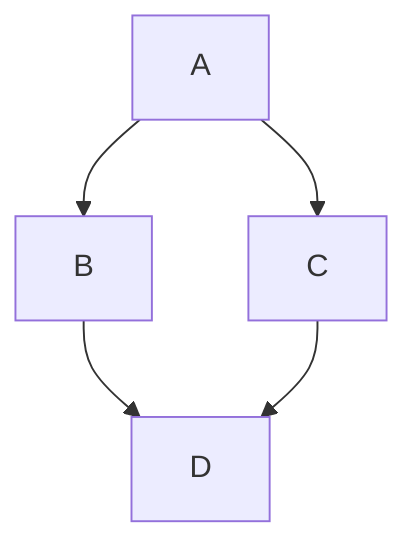

# Project Title

A brief description of what this project does and who it's for

<!-- region Shapes -->

## ASCII STL

```plaintext
solid cube_corner
  facet normal 0.0 -1.0 0.0
    outer loop
      vertex 0.0 0.0 0.0
      vertex 1.0 0.0 0.0
      vertex 0.0 0.0 1.0
    endloop
  endfacet
  facet normal 0.0 0.0 -1.0
    outer loop
      vertex 0.0 0.0 0.0
      vertex 0.0 1.0 0.0
      vertex 1.0 0.0 0.0
    endloop
  endfacet
  facet normal -1.0 0.0 0.0
    outer loop
      vertex 0.0 0.0 0.0
      vertex 0.0 0.0 1.0
      vertex 0.0 1.0 0.0
    endloop
  endfacet
  facet normal 0.577 0.577 0.577
    outer loop
      vertex 1.0 0.0 0.0
      vertex 0.0 1.0 0.0
      vertex 0.0 0.0 1.0
    endloop
  endfacet
endsolid
```

```stl
solid cube_corner
  facet normal 0.0 -1.0 0.0
    outer loop
      vertex 0.0 0.0 0.0
      vertex 1.0 0.0 0.0
      vertex 0.0 0.0 1.0
    endloop
  endfacet
  facet normal 0.0 0.0 -1.0
    outer loop
      vertex 0.0 0.0 0.0
      vertex 0.0 1.0 0.0
      vertex 1.0 0.0 0.0
    endloop
  endfacet
  facet normal -1.0 0.0 0.0
    outer loop
      vertex 0.0 0.0 0.0
      vertex 0.0 0.0 1.0
      vertex 0.0 1.0 0.0
    endloop
  endfacet
  facet normal 0.577 0.577 0.577
    outer loop
      vertex 1.0 0.0 0.0
      vertex 0.0 1.0 0.0
      vertex 0.0 0.0 1.0
    endloop
  endfacet
endsolid
```

<!-- endregion Shapes -->

<!-- region Geon -->

## TopoJSON
For example, you can create a TopoJSON map by specifying coordinates and shapes.

```json
{
  "type": "Topology",
  "transform": {
    "scale": [0.0005000500050005, 0.00010001000100010001],
    "translate": [100, 0]
  },
  "objects": {
    "example": {
      "type": "GeometryCollection",
      "geometries": [
        {
          "type": "Point",
          "properties": {"prop0": "value0"},
          "coordinates": [4000, 5000]
        },
        {
          "type": "LineString",
          "properties": {"prop0": "value0", "prop1": 0},
          "arcs": [0]
        },
        {
          "type": "Polygon",
          "properties": {"prop0": "value0",
            "prop1": {"this": "that"}
          },
          "arcs": [[1]]
        }
      ]
    }
  },
  "arcs": [[[4000, 0], [1999, 9999], [2000, -9999], [2000, 9999]],[[0, 0], [0, 9999], [2000, 0], [0, -9999], [-2000, 0]]]
}
```

```topojson
{
  "type": "Topology",
  "transform": {
    "scale": [0.0005000500050005, 0.00010001000100010001],
    "translate": [100, 0]
  },
  "objects": {
    "example": {
      "type": "GeometryCollection",
      "geometries": [
        {
          "type": "Point",
          "properties": {"prop0": "value0"},
          "coordinates": [4000, 5000]
        },
        {
          "type": "LineString",
          "properties": {"prop0": "value0", "prop1": 0},
          "arcs": [0]
        },
        {
          "type": "Polygon",
          "properties": {"prop0": "value0",
            "prop1": {"this": "that"}
          },
          "arcs": [[1]]
        }
      ]
    }
  },
  "arcs": [[[4000, 0], [1999, 9999], [2000, -9999], [2000, 9999]],[[0, 0], [0, 9999], [2000, 0], [0, -9999], [-2000, 0]]]
}
```


## GeoJSON
This section can include GeoJSON examples or descriptions.

```json
{
  "type": "FeatureCollection",
  "features": [
    {
      "type": "Feature",
      "id": 1,
      "properties": {
        "ID": 0
      },
      "geometry": {
        "type": "Polygon",
        "coordinates": [
          [
              [-90,35],
              [-90,30],
              [-85,30],
              [-85,35],
              [-90,35]
          ]
        ]
      }
    }
  ]
}
```

```geojson
{
  "type": "FeatureCollection",
  "features": [
    {
      "type": "Feature",
      "id": 1,
      "properties": {
        "ID": 0
      },
      "geometry": {
        "type": "Polygon",
        "coordinates": [
          [
              [-90,35],
              [-90,30],
              [-85,30],
              [-85,35],
              [-90,35]
          ]
        ]
      }
    }
  ]
}
```
<!-- endregion Geo -->

<!-- region Diagrams -->

## Diagrams

```markdown
graph TD;
    A-->B;
    A-->C;
    B-->D;
    C-->D;
```

<!-- endregion Diagrams -->

<!-- region Mathematical -->

## Mathematical
```markdown
This sentence uses `$` delimiters to show math inline: $\sqrt{3x-1}+(1+x)^2$
```
This sentence uses `$` delimiters to show math inline: $\sqrt{3x-1}+(1+x)^2$

```markdown
This sentence uses $\` and \`$ delimiters to show math inline: $`\sqrt{3x-1}+(1+x)^2`$
```
This sentence uses $\` and \`$ delimiters to show math inline: $`\sqrt{3x-1}+(1+x)^2`$

```markdown
**The Cauchy-Schwarz Inequality**
$$\left( \sum_{k=1}^n a_k b_k \right)^2 \leq \left( \sum_{k=1}^n a_k^2 \right) \left( \sum_{k=1}^n b_k^2 \right)$$
```
**The Cauchy-Schwarz Inequality**
$$\left( \sum_{k=1}^n a_k b_k \right)^2 \leq \left( \sum_{k=1}^n a_k^2 \right) \left( \sum_{k=1}^n b_k^2 \right)$$


```markdown
This expression uses `\$` to display a dollar sign: $`\sqrt{\$4}`$
```
This expression uses `\$` to display a dollar sign: $`\sqrt{\$4}`$


```markdown
To split <span>$</span>100 in half, we calculate $100/2$
```
To split <span>$</span>100 in half, we calculate $100/2$


<!-- endregion Mathematical -->

<!-- region Github  -->
## [Github styles](https://docs.github.com/en/get-started/writing-on-github/getting-started-with-writing-and-formatting-on-github/basic-writing-and-formatting-syntax)

## Headings

To create a heading, add one to six <kbd>#</kbd> symbols before your heading text. The number of <kbd>#</kbd> you use will determine the hierarchy level and typeface size of the heading.

```markdown
# A first-level heading
## A second-level heading
### A third-level heading
```


When you use two or more headings, GitHub automatically generates a table of contents that you can access by clicking  within the file header. Each heading title is listed in the table of contents and you can click a title to navigate to the selected section.


## Styling text

You can indicate emphasis with bold, italic, strikethrough, subscript, or superscript text in comment fields and `.md` files.

| Style | Syntax | Keyboard shortcut | Example | Output |
| --- | --- | --- | --- | --- |
| Bold | `** **` or `__ __`| <kbd>Command</kbd>+<kbd>B</kbd> (Mac) or <kbd>Ctrl</kbd>+<kbd>B</kbd> (Windows/Linux) | `**This is bold text**` | **This is bold text** |
| Italic | `* *` or `_ _`     | <kbd>Command</kbd>+<kbd>I</kbd> (Mac) or <kbd>Ctrl</kbd>+<kbd>I</kbd> (Windows/Linux) | `_This text is italicized_` | _This text is italicized_ |
| Strikethrough | `~~ ~~` | None | `~~This was mistaken text~~` | ~~This was mistaken text~~ |
| Bold and nested italic | `** **` and `_ _` | None | `**This text is _extremely_ important**` | **This text is _extremely_ important** |
| All bold and italic | `*** ***` | None | `***All this text is important***` | ***All this text is important*** | <!-- markdownlint-disable-line emphasis-style -->
| Subscript | `<sub> </sub>` | None | `This is a <sub>subscript</sub> text` | This is a <sub>subscript</sub> text |
| Superscript | `<sup> </sup>` | None | `This is a <sup>superscript</sup> text` | This is a <sup>superscript</sup> text |
| Underline | `<ins> </ins>` | None | `This is an <ins>underlined</ins> text` | This is an <ins>underlined</ins> text |

## Quoting text

You can quote text with a <kbd>></kbd>.

```markdown
Text that is not a quote

> Text that is a quote
```

Quoted text is indented with a vertical line on the left and displayed using gray type.


> [!NOTE]
> When viewing a conversation, you can automatically quote text in a comment by highlighting the text, then typing <kbd>R</kbd>. You can quote an entire comment by clicking , then **Quote reply**. For more information about keyboard shortcuts, see [AUTOTITLE](/get-started/accessibility/keyboard-shortcuts).

## Quoting code

You can call out code or a command within a sentence with single backticks. The text within the backticks will not be formatted. You can also press the <kbd>Command</kbd>+<kbd>E</kbd> (Mac) or <kbd>Ctrl</kbd>+<kbd>E</kbd> (Windows/Linux) keyboard shortcut to insert the backticks for a code block within a line of Markdown.

```markdown
Use `git status` to list all new or modified files that haven't yet been committed.
```


To format code or text into its own distinct block, use triple backticks.

````markdown
Some basic Git commands are:
```
git status
git add
git commit
```
````


For more information, see [AUTOTITLE](/get-started/writing-on-github/working-with-advanced-formatting/creating-and-highlighting-code-blocks).



## Supported color models

In issues, pull requests, and discussions, you can call out colors within a sentence by using backticks. A supported color model within backticks will display a visualization of the color.

```markdown
The background color is `#ffffff` for light mode and `#000000` for dark mode.
```


Here are the currently supported color models.

| Color | Syntax | Example | Output |
| --- | --- | --- | --- |
| HEX | <code>\`#RRGGBB\`</code> | <code>\`#0969DA\`</code> |  |
| RGB | <code>\`rgb(R,G,B)\`</code> | <code>\`rgb(9, 105, 218)\`</code> |  |
| HSL | <code>\`hsl(H,S,L)\`</code> | <code>\`hsl(212, 92%, 45%)\`</code> |  |

> [!NOTE]
> * A supported color model cannot have any leading or trailing spaces within the backticks.
> * The visualization of the color is only supported in issues, pull requests, and discussions.

## Links

You can create an inline link by wrapping link text in brackets `[ ]`, and then wrapping the URL in parentheses `( )`. You can also use the keyboard shortcut <kbd>Command</kbd>+<kbd>K</kbd> to create a link. When you have text selected, you can paste a URL from your clipboard to automatically create a link from the selection.

You can also create a Markdown hyperlink by highlighting the text and using the keyboard shortcut <kbd>Command</kbd>+<kbd>V</kbd>. If you'd like to replace the text with the link, use the keyboard shortcut <kbd>Command</kbd>+<kbd>Shift</kbd>+<kbd>V</kbd>.

`This site was built using [GitHub Pages](https://pages.github.com/).`


> [!NOTE]
>  automatically creates links when valid URLs are written in a comment. For more information, see [AUTOTITLE](/get-started/writing-on-github/working-with-advanced-formatting/autolinked-references-and-urls).

## Section links



If you need to determine the anchor for a heading in a file you are editing, you can use the following basic rules:

* Letters are converted to lower-case.
* Spaces are replaced by hyphens (`-`). Any other whitespace or punctuation characters are removed.
* Leading and trailing whitespace are removed.
* Markup formatting is removed, leaving only the contents (for example, `_italics_` becomes `italics`).
* If the automatically generated anchor for a heading is identical to an earlier anchor in the same document, a unique identifier is generated by appending a hyphen and an auto-incrementing integer.

For more detailed information on the requirements of URI fragments, see [RFC 3986: Uniform Resource Identifier (URI): Generic Syntax, Section 3.5](https://www.rfc-editor.org/rfc/rfc3986#section-3.5).

The code block below demonstrates the basic rules used to generate anchors from headings in rendered content.

```markdown
# Example headings

## Sample Section

## This'll be a _Helpful_ Section About the Greek Letter Θ!
A heading containing characters not allowed in fragments, UTF-8 characters, two consecutive spaces between the first and second words, and formatting.

## This heading is not unique in the file

TEXT 1

## This heading is not unique in the file

TEXT 2

# Links to the example headings above

Link to the sample section: [Link Text](#sample-section).

Link to the helpful section: [Link Text](#thisll-be-a-helpful-section-about-the-greek-letter-Θ).

Link to the first non-unique section: [Link Text](#this-heading-is-not-unique-in-the-file).

Link to the second non-unique section: [Link Text](#this-heading-is-not-unique-in-the-file-1).
```

> [!NOTE]
> If you edit a heading, or if you change the order of headings with "identical" anchors, you will also need to update any links to those headings as the anchors will change.

## Relative links



## Custom anchors

You can use standard HTML anchor tags (`<a name="unique-anchor-name"></a>`) to create navigation anchor points for any location in the document. To avoid ambiguous references, use a unique naming scheme for anchor tags, such as adding a prefix to the `name` attribute value.

> [!NOTE]
> Custom anchors will not be included in the document outline/Table of Contents.

You can link to a custom anchor using the value of the `name` attribute you gave the anchor. The syntax is exactly the same as when you link to an anchor that is automatically generated for a heading.

For example:

```markdown
# Section Heading

Some body text of this section.

<a name="my-custom-anchor-point"></a>
Some text I want to provide a direct link to, but which doesn't have its own heading.

(… more content…)

[A link to that custom anchor](#my-custom-anchor-point)
```

> [!TIP]
> Custom anchors are not considered by the automatic naming and numbering behavior of automatic heading links.

## Line breaks

If you're writing in issues, pull requests, or discussions in a repository,  will render a line break automatically:

```markdown
This example
Will span two lines
```

However, if you are writing in an .md file, the example above would render on one line without a line break. To create a line break in an .md file, you will need to include one of the following:

* Include two spaces at the end of the first line.
  <pre>
  This example&nbsp;&nbsp;
  Will span two lines
  </pre>
* Include a backslash at the end of the first line.

  ```markdown
  This example\
  Will span two lines
  ```

* Include an HTML single line break tag at the end of the first line.

  ```markdown
  This example<br/>
  Will span two lines
  ```

If you leave a blank line between two lines, both .md files and Markdown in issues, pull requests, and discussions will render the two lines separated by the blank line:

```markdown
This example

Will have a blank line separating both lines
```

## Images

You can display an image by adding <kbd>!</kbd> and wrapping the alt text in `[ ]`. Alt text is a short text equivalent of the information in the image. Then, wrap the link for the image in parentheses `()`.

``


 supports embedding images into your issues, pull requests, discussions, comments and `.md` files. You can display an image from your repository, add a link to an online image, or upload an image. For more information, see [Uploading assets](#uploading-assets).

> [!NOTE]
> When you want to display an image that is in your repository, use relative links instead of absolute links.

Here are some examples for using relative links to display an image.

| Context | Relative Link |
| ------ | -------- |
| In a `.md` file on the same branch | `https://raw.githubusercontent.com/github/docs/refs/heads/main/assets/images/electrocat.png` |
| In a `.md` file on another branch | `/../mainhttps://raw.githubusercontent.com/github/docs/refs/heads/main/assets/images/electrocat.png` |
| In issues, pull requests and comments of the repository | `../blob/mainhttps://raw.githubusercontent.com/github/docs/refs/heads/main/assets/images/electrocat.png?raw=true` |
| In a `.md` file in another repository | `/../../../../github/docs/blob/mainhttps://raw.githubusercontent.com/github/docs/refs/heads/main/assets/images/electrocat.png` |
| In issues, pull requests and comments of another repository | `../../../github/docs/blob/mainhttps://raw.githubusercontent.com/github/docs/refs/heads/main/assets/images/electrocat.png?raw=true` |

> [!NOTE]
> The last two relative links in the table above will work for images in a private repository only if the viewer has at least read access to the private repository that contains these images.

For more information, see [Relative Links](#relative-links).

### The Picture element

The `<picture>` HTML element is supported.

## Lists

You can make an unordered list by preceding one or more lines of text with <kbd>-</kbd>, <kbd>*</kbd>, or <kbd>+</kbd>.

```markdown
- George Washington
* John Adams
+ Thomas Jefferson
```


To order your list, precede each line with a number.

```markdown
1. James Madison
2. James Monroe
3. John Quincy Adams
```


### Nested Lists

You can create a nested list by indenting one or more list items below another item.

To create a nested list using the web editor on  or a text editor that uses a monospaced font, like [](https://code.visualstudio.com/), you can align your list visually. Type space characters in front of your nested list item until the list marker character (<kbd>-</kbd> or <kbd>*</kbd>) lies directly below the first character of the text in the item above it.

```markdown
1. First list item
   - First nested list item
     - Second nested list item
```

> [!NOTE]
> In the web-based editor, you can indent or dedent one or more lines of text by first highlighting the desired lines and then using <kbd>Tab</kbd> or <kbd>Shift</kbd>+<kbd>Tab</kbd> respectively.


To create a nested list in the comment editor on , which doesn't use a monospaced font, you can look at the list item immediately above the nested list and count the number of characters that appear before the content of the item. Then type that number of space characters in front of the nested list item.

In this example, you could add a nested list item under the list item `100. First list item` by indenting the nested list item a minimum of five spaces, since there are five characters (`100. `) before `First list item`.

```markdown
100. First list item
     - First nested list item
```


You can create multiple levels of nested lists using the same method. For example, because the first nested list item has seven characters (`␣␣␣␣␣-␣`) before the nested list content `First nested list item`, you would need to indent the second nested list item by at least two more characters (nine spaces minimum).

```markdown
100. First list item
     - First nested list item
       - Second nested list item
```


For more examples, see the [GitHub Flavored Markdown Spec](https://github.github.com/gfm/#example-265).

## Task lists



If a task list item description begins with a parenthesis, you'll need to escape it with <kbd>\\</kbd>:

`- [ ] \(Optional) Open a followup issue`

For more information, see [AUTOTITLE](/get-started/writing-on-github/working-with-advanced-formatting/about-task-lists).

## Mentioning people and teams

You can mention a person or [team](/organizations/organizing-members-into-teams) on  by typing <kbd>@</kbd> plus their username or team name. This will trigger a notification and bring their attention to the conversation. People will also receive a notification if you edit a comment to mention their username or team name. For more information about notifications, see [AUTOTITLE](/account-and-profile/managing-subscriptions-and-notifications-on-github/setting-up-notifications/about-notifications).

> [!NOTE]
> A person will only be notified about a mention if the person has read access to the repository and, if the repository is owned by an organization, the person is a member of the organization.

`@github/support What do you think about these updates?`


When you mention a parent team, members of its child teams also receive notifications, simplifying communication with multiple groups of people. For more information, see [AUTOTITLE](/organizations/organizing-members-into-teams/about-teams).

Typing an <kbd>@</kbd> symbol will bring up a list of people or teams on a project. The list filters as you type, so once you find the name of the person or team you are looking for, you can use the arrow keys to select it and press either tab or enter to complete the name. For teams, enter the @organization/team-name and all members of that team will get subscribed to the conversation.

The autocomplete results are restricted to repository collaborators and any other participants on the thread.

## Referencing issues and pull requests

You can bring up a list of suggested issues and pull requests within the repository by typing <kbd>#</kbd>. Type the issue or pull request number or title to filter the list, and then press either tab or enter to complete the highlighted result.

For more information, see [AUTOTITLE](/get-started/writing-on-github/working-with-advanced-formatting/autolinked-references-and-urls).

## Referencing external resources



## Uploading assets

You can upload assets like images by dragging and dropping, selecting from a file browser, or pasting. You can upload assets to issues, pull requests, comments, and `.md` files in your repository.

## Using emojis

You can add emoji to your writing by typing `:EMOJICODE:`, a colon followed by the name of the emoji.

`@octocat :+1: This PR looks great - it's ready to merge! :shipit:`


Typing <kbd>:</kbd> will bring up a list of suggested emoji. The list will filter as you type, so once you find the emoji you're looking for, press **Tab** or **Enter** to complete the highlighted result.

For a full list of available emoji and codes, see [the Emoji-Cheat-Sheet](https://github.com/ikatyang/emoji-cheat-sheet/blob/master/README.md).

## Paragraphs

You can create a new paragraph by leaving a blank line between lines of text.

## Footnotes

You can add footnotes to your content by using this bracket syntax:

```text
Here is a simple footnote[^1].

A footnote can also have multiple lines[^2].

[^1]: My reference.
[^2]: To add line breaks within a footnote, prefix new lines with 2 spaces.
  This is a second line.
```

The footnote will render like this:


> [!NOTE]
> The position of a footnote in your Markdown does not influence where the footnote will be rendered. You can write a footnote right after your reference to the footnote, and the footnote will still render at the bottom of the Markdown. Footnotes are not supported in wikis.

## Alerts

Alerts are a Markdown extension based on the blockquote syntax that you can use to emphasize critical information. On , they are displayed with distinctive colors and icons to indicate the significance of the content.

Use alerts only when they are crucial for user success and limit them to one or two per article to prevent overloading the reader. Additionally, you should avoid placing alerts consecutively. Alerts cannot be nested within other elements.

To add an alert, use a special blockquote line specifying the alert type, followed by the alert information in a standard blockquote. Five types of alerts are available:

```markdown
> [!NOTE]
> Useful information that users should know, even when skimming content.

> [!TIP]
> Helpful advice for doing things better or more easily.

> [!IMPORTANT]
> Key information users need to know to achieve their goal.

> [!WARNING]
> Urgent info that needs immediate user attention to avoid problems.

> [!CAUTION]
> Advises about risks or negative outcomes of certain actions.
```

Here are the rendered alerts:


## Hiding content with comments

You can tell  to hide content from the rendered Markdown by placing the content in an HTML comment.

```text
<!-- This content will not appear in the rendered Markdown -->
```

## Ignoring Markdown formatting

You can tell  to ignore (or escape) Markdown formatting by using <kbd>\\</kbd> before the Markdown character.

`Let's rename \*our-new-project\* to \*our-old-project\*.`


For more information on backslashes, see Daring Fireball's [Markdown Syntax](https://daringfireball.net/projects/markdown/syntax#backslash).

> [!NOTE]
> The Markdown formatting will not be ignored in the title of an issue or a pull request.

<!-- endregion Github -->


## Disabling Markdown rendering



## Further reading

* [ Flavored Markdown Spec](https://github.github.com/gfm/)
* [AUTOTITLE](/get-started/writing-on-github/getting-started-with-writing-and-formatting-on-github/about-writing-and-formatting-on-github)
* [AUTOTITLE](/get-started/writing-on-github/working-with-advanced-formatting)
* [AUTOTITLE](/get-started/writing-on-github/getting-started-with-writing-and-formatting-on-github/quickstart-for-writing-on-github)


## Acknowledgements

 - [Awesome Readme Templates](https://awesomeopensource.com/project/elangosundar/awesome-README-templates)
 - [Awesome README](https://github.com/matiassingers/awesome-readme)
 - [How to write a Good readme](https://bulldogjob.com/news/449-how-to-write-a-good-readme-for-your-github-project)


## API Reference

#### Get all items

```http
  GET /api/items
```

| Parameter | Type     | Description                |
| :-------- | :------- | :------------------------- |
| `api_key` | `string` | **Required**. Your API key |

#### Get item

```http
  GET /api/items/${id}
```

| Parameter | Type     | Description                       |
| :-------- | :------- | :-------------------------------- |
| `id`      | `string` | **Required**. Id of item to fetch |

#### add(num1, num2)

Takes two numbers and returns the sum.


## Appendix

Any additional information goes here


## Authors

- [@octokatherine](https://www.github.com/octokatherine)


## Badges

Add badges from somewhere like: [shields.io](https://shields.io/)

[](https://choosealicense.com/licenses/mit/)
[](https://opensource.org/licenses/)
[](http://www.gnu.org/licenses/agpl-3.0)

## Color Reference

| Color             | Hex                                                                |
| ----------------- | ------------------------------------------------------------------ |
| Example Color |  #0a192f |
| Example Color |  #f8f8f8 |
| Example Color |  #00b48a |
| Example Color |  #00d1a0 |


## Contributing

Contributions are always welcome!

See `contributing.md` for ways to get started.

Please adhere to this project's `code of conduct`.


## Demo

Insert gif or link to demo


## Deployment

To deploy this project run

```bash
  npm run deploy
```


## Documentation

[Documentation](https://linktodocumentation)


## Environment Variables

To run this project, you will need to add the following environment variables to your .env file

`API_KEY`

`ANOTHER_API_KEY`


## FAQ

#### Question 1

Answer 1

#### Question 2

Answer 2


## Feedback

If you have any feedback, please reach out to us at fake@fake.com


## Features

- Light/dark mode toggle
- Live previews
- Fullscreen mode
- Cross platform


# Hi, I'm Katherine! 👋


## 🚀 About Me
I'm a full stack developer...


## 🔗 Links
[](https://katherineoelsner.com/)
[](https://www.linkedin.com/)
[](https://twitter.com/)


## Other Common Github Profile Sections
👩‍💻 I'm currently working on...

🧠 I'm currently learning...

👯‍♀️ I'm looking to collaborate on...

🤔 I'm looking for help with...

💬 Ask me about...

📫 How to reach me...

😄 Pronouns...

⚡️ Fun fact...


## 🛠 Skills
Javascript, HTML, CSS...


## Installation

Install my-project with npm

```bash
  npm install my-project
  cd my-project
```
    
## Lessons Learned

What did you learn while building this project? What challenges did you face and how did you overcome them?


## License

[MIT](https://choosealicense.com/licenses/mit/)


## Optimizations

What optimizations did you make in your code? E.g. refactors, performance improvements, accessibility


## Related

Here are some related projects

[Awesome README](https://github.com/matiassingers/awesome-readme)


## Roadmap

- Additional browser support

- Add more integrations


## Run Locally

Clone the project

```bash
  git clone https://link-to-project
```

Go to the project directory

```bash
  cd my-project
```

Install dependencies

```bash
  npm install
```

Start the server

```bash
  npm run start
```


## Screenshots


## Support

For support, email fake@fake.com or join our Slack channel.


## Tech Stack

**Client:** React, Redux, TailwindCSS

**Server:** Node, Express


## Running Tests

To run tests, run the following command

```bash
  npm run test
```


## Used By

This project is used by the following companies:

- Company 1
- Company 2


## Usage/Examples

```javascript
import Component from 'my-project'

function App() {
  return <Component />
}
```

